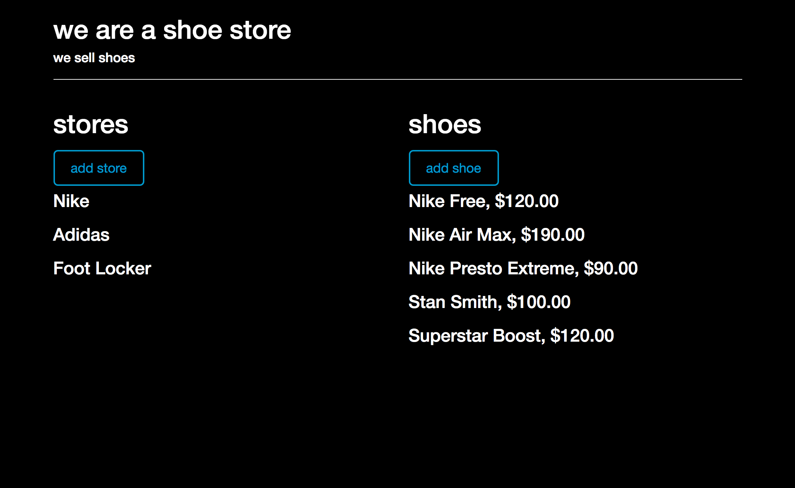
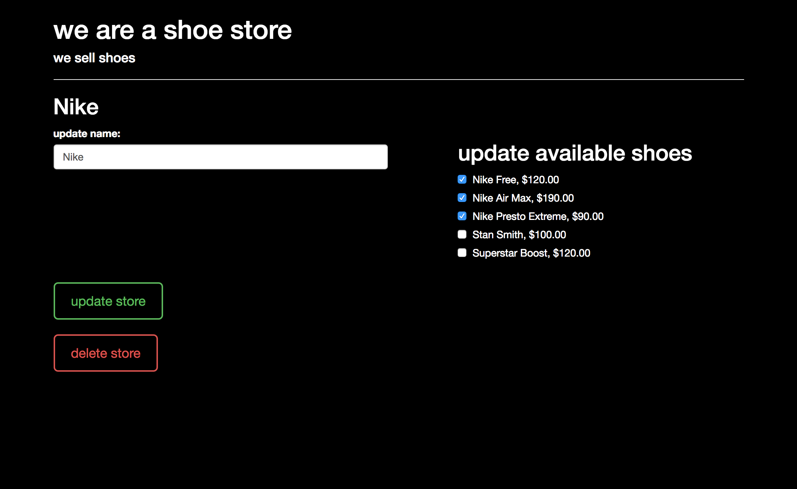
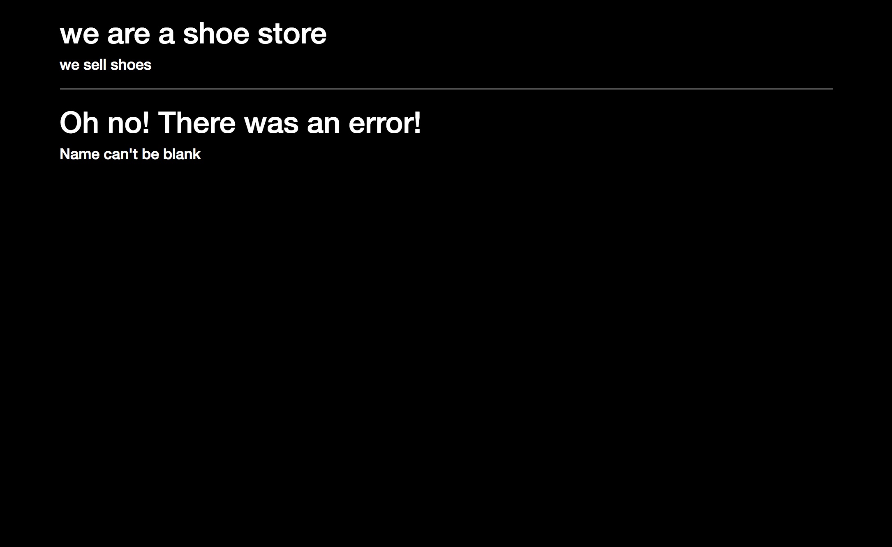

# Shoe Store

What if you owned multiple shoe stores and lots of inventory? Well with this app you will be able to price all your shoes and update which stores have what shoes in stock! This app will allow you to create new stores and add new styles of shoes whenever you need to! It has also got your back with regards to bad data, the app validates everything thats input!

### What I Learned

The lesson that keeps giving, validation! ActiveRecord makes some things easier but introduces some new obstacles as well. I learned that to test for uniqueness I would have to run my callback first which in turn broke tests that expected the callback to happen after validation. I fixed the bug by updating the callback to only run if the property was present.

I was pleasantly surprised that ActiveRecord validates numbers with decimals and that there is also an option to disallow decimals!

In the same vein as validation, I learned about ActveRecord errors. It was great to know that if the object failed to save to the database then the object would be updated with the errors as to why. I had to read the documentation to figure out how to get at the messages without altering them but once I got that I displayed the error to the user.

Something I got stuck on and had to rework was that I wanted to use a Flash cookie for error messages. Since I could not get this to work, I will be doing more research to figure out how to get Flash to work in Sinatra. My workaround was to use a cookie to store the error message from an ActiveRecord error and use that to display the message to the user. The problem with this would likely be persistence of the message but I set the cookie back to nil after it was displayed.

### Prerequisites

Web browser with ES6 compatibility
Examples: Chrome, Safari

Ruby 2.4.1
Bundler

### Installing

Installation is quick and easy! First you can open this link https://murmuring-shelf-47892.herokuapp.com/ to see the webpage in action live online. Or you can clone this repository to your machine, navigate to the file path in your terminal, and run 'app.rb' by typing $'bundle exec ruby app.rb'. If you chose to clone the repository you will need to follow the instructions for setting up your database first. After you run 'app.rb' you will need to copy the localhost path into your web browser. The standard localhost for Sinatra is port 4567.

#### Setting up the Database

Rake makes setting up a new databse on your machine quick and easy! There are two commands you will need to run from your terminal. Make sure you navigate to the correct directory first!

* bundle exec rake db:create
* bundle exec rake db:schema:load

And thats it!

## Built With

* Ruby
* Sinatra
* HTML
* CSS
* Bootstrap https://getbootstrap.com/
* ES6
* Jquery https://jquery.com/

## Screenshots

#### Homepage

#### Editing a store

#### Encountering an error

## Authors

* Spencer Alan Ruiz

## License

MIT License

Copyright (c) 2017 Spencer Alan Ruiz

Permission is hereby granted, free of charge, to any person obtaining a copy
of this software and associated documentation files (the "Software"), to deal
in the Software without restriction, including without limitation the rights
to use, copy, modify, merge, publish, distribute, sublicense, and/or sell
copies of the Software, and to permit persons to whom the Software is
furnished to do so, subject to the following conditions:

The above copyright notice and this permission notice shall be included in all
copies or substantial portions of the Software.

THE SOFTWARE IS PROVIDED "AS IS", WITHOUT WARRANTY OF ANY KIND, EXPRESS OR
IMPLIED, INCLUDING BUT NOT LIMITED TO THE WARRANTIES OF MERCHANTABILITY,
FITNESS FOR A PARTICULAR PURPOSE AND NONINFRINGEMENT. IN NO EVENT SHALL THE
AUTHORS OR COPYRIGHT HOLDERS BE LIABLE FOR ANY CLAIM, DAMAGES OR OTHER
LIABILITY, WHETHER IN AN ACTION OF CONTRACT, TORT OR OTHERWISE, ARISING FROM,
OUT OF OR IN CONNECTION WITH THE SOFTWARE OR THE USE OR OTHER DEALINGS IN THE
SOFTWARE.

